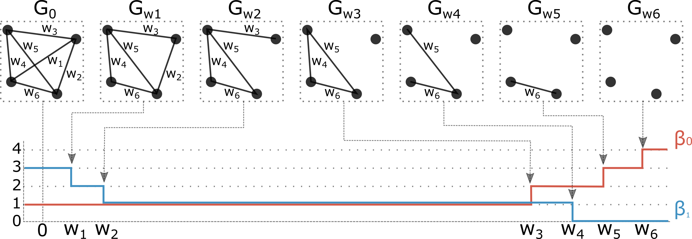

  

About
-----
This is a code repository written in MATLAB for the simulation study presented in the paper:
[TBD]

The simulation study aims to evaluate discriminative performance of the proposed topological loss against
four well-known graph matching algorithms including graduated assignment [1], spectral matching [2], integer projected fixed point method [3] and reweighted random walk matching [4].
In addition, the study also evaluates run time efficiency of each algorithm.

Quick start
-----------
1. Prerequisite: install _Statistics and Machine Learning Toolbox_
2. Run `make` to compile and link C++ source files used for the baseline algorithms
3. Execute `run_simulation` and `track_runtime` scripts

Organization
------------
Code is organized as follows.
- `./lib` directory contains source code for the baseline algorithms
- `./src` directory contains the main implementation for the simulation study
- `make.m` is a makefile for C++ source files used for the baseline algorithms
- `run_simulation.m` runs the statistic simulations
- `track_runtime.m` performs a rigorous measurement of execution time for each algorithm

Contact
-------
If you have any questions, please feel free to contact Tananun Songdechakraiwut (<songdechakra@wisc.edu>).

Acknowledgements
----------------
We thank all the authors for their generosity of sharing code [1-5].

References
----------
[1] Gold, S., Rangarajan, A.: A graduated assignment algorithm for graph matching. IEEE Transactions on Pattern Analysis and Machine Intelligence 18(4) (1996)

[2] Leordeanu, M., Hebert, M.: A spectral technique for correspondence problems using pairwise constraints. In: International Conference on Computer Vision. pp. 1482–1489. IEEE (2005)

[3] Leordeanu, M., Hebert, M., Sukthankar, R.: An integer projected fixed point method for graph matching and map inference. In: Advances in Neural Information Processing Systems. pp. 1114–1122 (2009)

[4] Cho, M., Lee, J., Lee, K.M.: Reweighted random walks for graph matching. In: European Conference on Computer Vision. pp. 492–505. Springer (2010)

[5] Zhou, F., De la Torre, F.: Deformable graph matching. In: Proceedings of the IEEE Conference on Computer Vision and Pattern Recognition. pp. 2922-2929 (2013)
